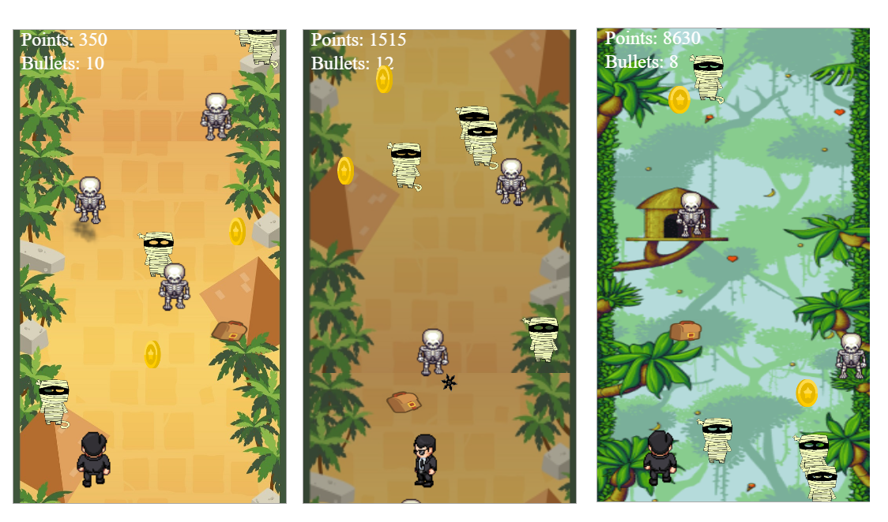

### Criminal Game 
Game for android and browser platforms. Detailed description below.

### Description: 
- this is type of endless game
- if the enemy hits the player it's game over 
- control the player with right, left, up arrows and accelerometer on the phone
- shouting by clicking spacebar or tap to screen
- scrolling background, it gets day and night
  in the point range from 8 to 10.5 and from 20 to 26 thousand we enter the jungle  
  (the background is changes)
- applied animated sprites for player, enemies and bonuses
- sound effects, vibration when we shooting or collect bonuses
- sound effects, vibration and enemy explosion animation 
- the mumia dies after the one shot, the skeleton after 2.
- after 2000 points the skeletons respawn stronger, to kill them it takes 3 shots
- points increase with time and also by killing monsters and collecting coins
- killing a mumia gives 30 (thirty) points, a skeleton 60 points, and a coin gives 100 points.
- the number of available bullets grows over time. Maximum 10
  After 2000 points: 15 max
- catching the backpack bonus gives you +10 bullets
- the bullet becomes inactive when it touches the top of the canvas  
- after scoring a certain number of points, the enemies get faster
- faster breakpoints for 
mumia: 200, 500, 1000, 3000
skeleton and bonuses: 500, 1000, 3000, 7000
player: 300, 1000, 3000
- Total points, numberOfBulletsFired, Killed enemies broken down by type (mumia/skeleton), earnedCoins  are counted and displayed at the end of the game

### Technologies
Project is created with:
* Apache Cordova: 10.0

#### Author 
Aleksandra Miazek
